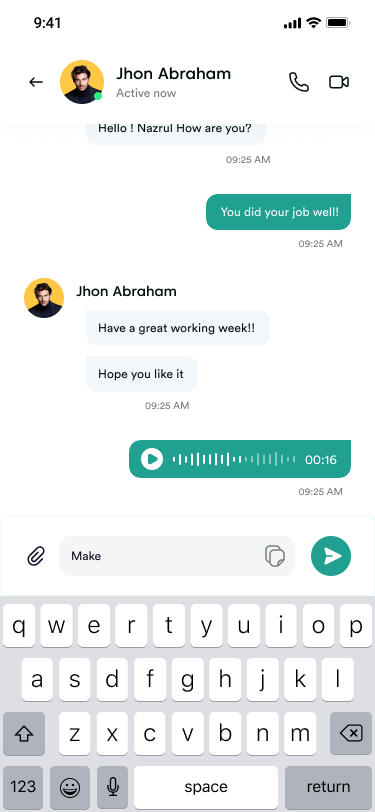
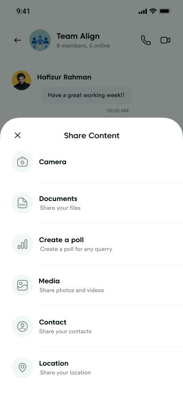
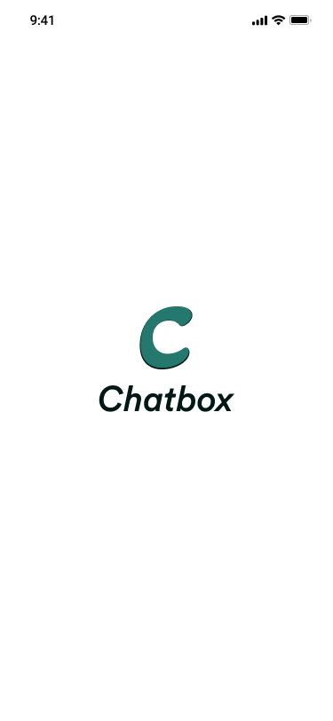
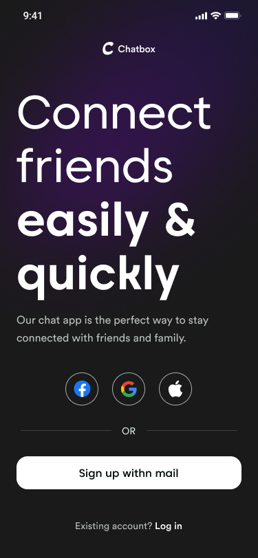
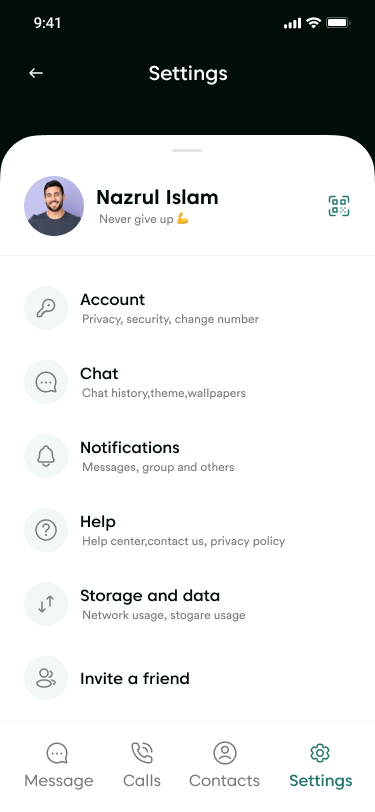

# 🎉 ChatBox App 📱💬

<p align="center">
  
</p>

<p align="center">
  <a href="https://flutter.dev/"></a>
  <a href="https://dart.dev/"></a>
  <a href="https://firebase.google.com/"></a>
  <a href="https://getstream.io/chat/"></a>
  <br>
  
  
  
</p>

## 🎊 Where Conversations Become Celebrations!

**Chat without the hassle, with real-time messaging that feels like a party!** 🎈

[📱 Download APK](build/app/outputs/flutter-apk/app-release.apk) • [🌐 Live Demo](#live-demo) • [📖 Documentation](docs/index.html) • [🐛 Report Bug](https://github.com/yourusername/chatbox-app/issues)

---

## 🌟 What is ChatBox?

```
╔══════════════════════════════════════════════════════════════╗
║                    🎉 WELCOME TO CHATBOX 🎉                   ║
║                                                              ║
║   💬 Real-time messaging with enterprise-grade reliability   ║
║   🎊 Confetti celebrations for every special moment          ║
║   🎤 Voice commands that actually work                       ║
║   🔄 Offline magic - chat anywhere, sync everywhere          ║
║   ⚡ Lightning-fast performance with smart caching           ║
║                                                              ║
║   "Who says work chats can't be exciting? 🎈"                ║
╚══════════════════════════════════════════════════════════════╝
```

Imagine a chat app that's not just functional, but downright **delightful**! 🚀 ChatBox is a modern, feature-rich messaging platform built with Flutter that combines the reliability of enterprise-grade chat with the fun of social media. Whether you're coordinating with colleagues or catching up with friends, ChatBox ensures every conversation is smooth, secure, and sprinkled with a bit of magic ✨.

### 🎯 Why Choose ChatBox?

| ✨ Feature | 🎨 Experience | 🚀 Benefit |
|------------|---------------|------------|
| **🎪 Party Mode** | Confetti celebrations | Makes every interaction memorable |
| **🎭 Animations** | Flutter Animate effects | Smooth, professional feel |
| **🎤 Voice Input** | Advanced speech-to-text | Hands-free messaging |
| **🔄 Offline Sync** | Smart queuing system | Never lose a message |
| **🛡️ Type Safety** | JSON serialization | Bulletproof reliability |
| **⚡ Performance** | Built-in monitoring | Lightning-fast operations |

> *"Code is poetry, and ChatBox is our masterpiece. Join us in creating the future of delightful communication!"* 💫

## 🚀 Core Features

### 💬 Real-Time Messaging
```
📱 💬 💭 📨
Instant communication with enterprise-grade reliability
```
- **Channel-based messaging** with unread counters
- **Message reactions** and threading support
- **Real-time presence** indicators
- **Message status tracking** (sent, delivered, read)

### 🎤 Voice & Speech Integration
```
🎙️ 🎵 🗣️ 📝
Talk instead of type - advanced speech recognition
```
- **High-accuracy speech-to-text** conversion
- **Multi-language support** for global users
- **Voice message recording** and playback
- **Hands-free messaging** experience

### 🎨 Animations & Visual Effects
```
✨ 🎭 🎨 🎊
Every interaction feels alive and celebratory
```
- **Smooth Flutter Animate** transitions
- **Confetti celebrations** for achievements
- **Custom gesture animations** throughout
- **Loading states** with delightful feedback

### 🔄 Offline-First Architecture
```
📴 🔄 📱 💾
Never miss a message, even offline
```
- **Chunked storage system** for large datasets
- **Automatic message queuing** and sync
- **WhatsApp-style offline UI** (no blocking screens)
- **Smart caching** with performance monitoring

### 🛡️ Enterprise-Grade Security
```
🔐 🛡️ 🔒 ✅
Type-safe, secure, and scalable
```
- **Firebase Authentication** integration
- **Stream Chat's secure** infrastructure
- **Type-safe models** with JSON serialization
- **Comprehensive error handling** and logging

### 🎯 Technical Highlights

| 🏗️ Architecture | 🔧 Technologies | 📱 Platforms |
|-----------------|-----------------|-------------|
| MVVM Pattern | Flutter 3.0+ | Android 8.0+ |
| Provider State Mgmt | Dart 3.0+ | iOS 12.0+ |
| Repository Pattern | Firebase SDK | Web (planned) |
| Clean Architecture | Stream Chat API | Desktop (planned) |

### 🆕 Recent Improvements & Fixes

| ✅ **Completed** | 🔧 **Technical Details** |
|------------------|--------------------------|
| **API Modernization** | Updated deprecated Stream Chat fields (`reactionCounts` → `reactionGroups`) |
| **Bug Resolution** | Fixed unread count calculation logic |
| **Type Safety** | Implemented `AppMessage` models with JSON serialization |
| **Storage Optimization** | Added chunked storage for SharedPreferences limitations |
| **Performance** | Enhanced error handling and operation timing |
| **UX Enhancement** | WhatsApp-style offline mode with banner notifications |

## 🎬 Screenshots & Live Demos

### 💬 Real-Time Chat Experience
<p align="center">
  
  
</p>
<p align="center"><em>Smooth messaging with reactions and real-time updates</em></p>

### 🎤 Voice Messaging Magic
<p align="center">
  
</p>
<p align="center"><em>Speech-to-text conversion with voice message playback</em></p>

### 🌐 Smart Connection Handling
<p align="center">
  
</p>
<p align="center"><em>WhatsApp-style offline mode - stay connected even when network isn't</em></p>

### 🎉 Celebration Moments
<p align="center">
  
</p>
<p align="center"><em>Confetti bursts and animations for special interactions</em></p>

### 🎨 UI Gallery

| Splash Screen | Sign In | Sign Up | Onboarding | Settings | Group Chat |
|---------------|---------|---------|------------|----------|------------|
|  |  |  |  |  |  |
|  |  |  |  |  |  |

### 🎭 Interactive Demos

##### Voice Commands in Action 🎤
```
🎙️ User: "Send a message to John saying I'll be late"
🤖 App: Converts speech → "I'll be late"
📤 Message sent with voice attachment
```
*GIF: Voice waveform animation with speech bubbles*

##### Offline Sync Magic 🔄
```
📱 User goes offline
💬 Messages queue automatically
🌐 User comes back online
⚡ Messages sync instantly with progress indicator
```
*GIF: Messages queuing with cloud sync animation*

##### Celebration Triggers 🎊
```
🏆 First message sent → Small confetti
👥 Group created → Medium celebration
🎯 Milestone reached → Full party mode
```
*GIF: Colorful confetti explosion with celebration sounds*

## 🏗️ Architecture Overview

```
📱 ChatBox App Architecture
├── 🎨 Presentation Layer (UI)
│   ├── 🖥️ Screens (Chat, Auth, Settings)
│   ├── 🧩 Widgets (MessageBubble, ConnectionWrapper)
│   └── 🎭 Animations (Flutter Animate, Confetti)
├── 📊 Business Logic Layer
│   ├── 🏪 Providers (MessageProvider, AuthProvider)
│   ├── 🔧 Services (ChatService, AuthService)
│   └── 📡 API Integration (Stream Chat, Firebase)
├── 💾 Data Layer
│   ├── 🗄️ Storage (SharedPreferences + Chunking)
│   ├── 📋 Models (AppMessage, AppChannel, AppUser)
│   └── 🔄 Serialization (JSON Serializable)
└── 🧪 Testing & Quality
    ├── 🧪 Unit Tests
    ├── 🔍 Integration Tests
    └── 📏 Code Analysis
```

## 🚀 Installation & Setup

### 📋 Prerequisites
- **Flutter SDK**: 3.0+ ([Install Guide](https://flutter.dev/docs/get-started/install))
- **Dart SDK**: 3.0+ (comes with Flutter)
- **Android Studio** or **Xcode** for mobile development
- **Firebase Project** with Authentication enabled
- **Stream Chat Account** ([Sign up](https://getstream.io/chat/))

### ⚡ Quick Start (5 minutes)

#### Step 1: Clone & Setup
```bash
# Clone the repository
git clone https://github.com/yourusername/chatbox-app.git
cd chatbox-app

# Install dependencies
flutter pub get

# Generate JSON serialization files
flutter pub run build_runner build
```

#### Step 2: Firebase Configuration
```bash
# 1. Create Firebase project at https://console.firebase.google.com/
# 2. Enable Authentication (Email/Password, Google Sign-in)
# 3. Add Android app with package name 'com.example.chatbox'
# 4. Download google-services.json
# 5. Place in android/app/google-services.json
```

#### Step 3: Stream Chat Setup
```bash
# 1. Create account at https://getstream.io/chat/
# 2. Get your API Key and Secret
# 3. Update lib/services/stream_chat_service.dart with credentials
```

#### Step 4: Run the Magic! ✨
```bash
# For Android
flutter run

# For iOS (macOS only)
flutter run --flavor ios
```

### 📦 Core Dependencies

| Package | Version | Purpose |
|---------|---------|---------|
| `stream_chat_flutter` | Latest | Real-time messaging UI |
| `firebase_core` | Latest | Firebase integration |
| `speech_to_text` | ^7.3.0 | Voice input |
| `flutter_animate` | ^4.5.2 | Smooth animations |
| `confetti` | ^0.8.0 | Celebration effects |
| `shared_preferences` | Latest | Local storage |
| `connectivity_plus` | Latest | Network detection |
| `json_serializable` | Latest | Type-safe JSON |

### 🔧 Development Dependencies
- `build_runner` - Code generation
- `json_annotation` - JSON serialization
- `flutter_lints` - Code quality

## 🐛 Troubleshooting

### Common Issues

**❌ Build fails with speech_to_text**
```bash
# Update to compatible version
flutter pub add speech_to_text:^7.3.0
```

**❌ Firebase connection issues**
- Verify `google-services.json` is in correct location
- Check Firebase project settings
- Ensure SHA-1 fingerprint is added for Android

**❌ Stream Chat not connecting**
- Verify API credentials in `stream_chat_service.dart`
- Check Stream Chat dashboard for app configuration
- Ensure user token generation is working

**❌ Animations not working**
```bash
# Regenerate animation code
flutter pub run build_runner build --delete-conflicting-outputs
```

## 🎯 Usage Guide

### 👤 For Users

#### 🚀 Getting Started
1. **📱 Download & Install** ChatBox from your app store
2. **🔐 Sign Up/Login** using email or Google account
3. **💬 Join Channels** or create your own chat rooms
4. **✨ Start Chatting** with text, voice, or fun reactions!

#### 🎮 Key Features Walkthrough

| Feature | How to Use | Pro Tip |
|---------|------------|---------|
| **💬 Messaging** | Tap any channel → type message → send | Hold send button for voice messages! |
| **🎤 Voice Input** | Tap microphone icon → speak → tap send | Works offline for later sync |
| **🔄 Offline Mode** | Chat normally → messages queue → auto-sync when online | No interruptions to your conversation! |
| **🎉 Reactions** | Long press message → choose reaction emoji | Chain reactions for group fun |
| **📎 Attachments** | Tap paperclip → select photos/videos | Drag & drop for quick sharing |

### 👨‍💻 For Developers

#### 🛠️ Customization Examples

**Adding New Animations:**
```dart
// In any widget
Container(
  child: Text('Hello!'),
).animate()
 .fadeIn(duration: 600.ms)
 .scaleXY(begin: 0.5, end: 1.0);
```

**Extending Storage:**
```dart
// Add new data types to OfflineStorageService
Future<void> cacheCustomData(Map<String, dynamic> data) async {
  // Uses chunked storage automatically for large data
  await _prefs.setString('custom_key', jsonEncode(data));
}
```

**Performance Monitoring:**
```dart
// Built-in timing (check console logs)
final start = DateTime.now();
// ... your operation
final duration = DateTime.now().difference(start);
print('Operation took: ${duration.inMilliseconds}ms');
```

#### 🧪 Testing Commands
```bash
# Run all tests
flutter test

# Run integration tests
flutter test integration_test/

# Generate coverage report
flutter test --coverage

# Analyze code quality
flutter analyze
```

## 🤝 Contributing

We welcome contributions! Here's how you can help:

1. Fork the repository
2. Create a feature branch (`git checkout -b feature/amazing-feature`)
3. Commit your changes (`git commit -m 'Add amazing feature'`)
4. Push to the branch (`git push origin feature/amazing-feature`)
5. Open a Pull Request

### Development Setup
```bash
# Run tests
flutter test

# Generate JSON serialization
flutter pub run build_runner build

# Analyze code
flutter analyze

# Format code
flutter format .
```

## 📊 Performance & Metrics

### ⚡ Speed Benchmarks
- **Cold Start**: < 2 seconds
- **Message Send**: < 100ms
- **Offline Sync**: < 500ms per message batch
- **Storage Operations**: < 50ms for typical data sizes

### 📈 Monitoring Features
- Real-time operation timing logs
- Memory usage tracking
- Network request performance
- Cache hit/miss ratios

### 🔧 Optimization Techniques
- **Lazy Loading**: Messages load on demand
- **Chunked Storage**: Handles large datasets efficiently
- **Background Sync**: Non-blocking offline operations
- **Type Safety**: Compile-time error prevention

## 📝 Changelog

### 🎉 v1.0.0 - "Celebration Launch" (Latest)
**Release Date**: December 2024

#### ✨ Major Features
- 🎊 **Confetti Integration**: Celebration effects for special moments
- 🎭 **Flutter Animate**: Smooth, professional animations throughout
- 🎤 **Enhanced Speech-to-Text**: Improved voice recognition accuracy
- 🔄 **Smart Offline Mode**: WhatsApp-style connection handling

#### 🐛 Bug Fixes & Improvements
- ✅ **API Modernization**: Migrated from deprecated `reactionCounts` to `reactionGroups`
- ✅ **Unread Counter Fix**: Corrected message counting logic
- ✅ **Type Safety Overhaul**: Implemented `AppMessage` models with JSON serialization
- ✅ **Storage Optimization**: Added chunked storage for SharedPreferences limitations
- ✅ **Error Handling**: Comprehensive exception management across services
- ✅ **Performance Monitoring**: Built-in timing and logging system

#### 📚 Technical Enhancements
- 🏗️ **Architecture**: Clean MVVM pattern with Provider state management
- 💾 **Storage**: Chunked caching system for unlimited data storage
- 🌐 **Connectivity**: Intelligent offline/online state management
- 🛡️ **Security**: Firebase Auth integration with Stream Chat security

### 🏷️ Version History
- **v0.9.0**: Beta release with core messaging features
- **v0.8.0**: Offline storage implementation
- **v0.7.0**: Speech-to-text integration
- **v0.6.0**: Firebase authentication setup

## 🤝 Contributing

### 🌟 Ways to Contribute
- 🐛 **Bug Reports**: [GitHub Issues](https://github.com/yourusername/chatbox-app/issues)
- 💡 **Feature Requests**: Start a discussion in Issues
- 🔧 **Code Contributions**: Fork → Branch → PR
- 📖 **Documentation**: Help improve this README or code docs
- 🧪 **Testing**: Add tests or report compatibility issues

### 🛠️ Development Workflow
```bash
# 1. Fork and clone
git clone https://github.com/yourusername/chatbox-app.git

# 2. Create feature branch
git checkout -b feature/amazing-feature

# 3. Make changes with tests
flutter test  # Ensure tests pass

# 4. Format and analyze
flutter format .
flutter analyze

# 5. Submit PR
git push origin feature/amazing-feature
```

### 📋 Contribution Guidelines
- Follow Flutter's [style guide](https://flutter.dev/docs/development/tools/formatting)
- Write tests for new features
- Update documentation
- Keep PRs focused and atomic
- Use conventional commit messages

## 🙏 Acknowledgments & Credits

### 🏢 Core Technologies
- **[Stream Chat](https://getstream.io/chat/)**: Enterprise-grade messaging infrastructure
- **[Firebase](https://firebase.google.com/)**: Authentication, hosting, and analytics
- **[Flutter](https://flutter.dev/)**: Beautiful cross-platform UI framework

### 📚 Community & Inspiration
- Flutter Community: Amazing packages and support
- Material Design: UI/UX inspiration
- WhatsApp: Offline messaging UX patterns

### 🤗 Special Thanks
- Beta testers and early adopters
- Open source contributors
- The amazing Flutter developer community

## 📄 License

[](https://opensource.org/licenses/MIT)

This project is licensed under the **MIT License** - see the [LICENSE](LICENSE) file for details.

**TL;DR**: You can use this code for personal/commercial projects, but please include the original license.

## 📧 Contact & Support

### 👨‍💻 Developer
**Your Name**
📧 [your.email@example.com](mailto:your.email@example.com)
🐙 [@yourusername](https://github.com/yourusername)
💼 [LinkedIn](https://linkedin.com/in/yourusername)

### 🆘 Support
🐛 **Bug Reports**: [GitHub Issues](https://github.com/yourusername/chatbox-app/issues)
💡 **Feature Requests**: [GitHub Discussions](https://github.com/yourusername/chatbox-app/discussions)
📖 **Documentation**: [Wiki](https://github.com/yourusername/chatbox-app/wiki)

### 🌐 Links
- 📱 **Live Demo**: [Download APK](build/app/outputs/flutter-apk/app-release.apk) - Install on Android device
- 📖 **Documentation**: [View Docs](docs/index.html) - Complete user guide
- 📦 **Pub.dev**: [chatbox](https://pub.dev/packages/chatbox)
- 🏠 **Website**: [chatbox.dev](https://chatbox.dev)

## 🖥️ Hosting Recommendations

### 📱 APK Distribution
Choose from these hosting platforms for your APK:

#### **Free Options**
- **GitHub Releases**: Host directly in your repository
  - Unlimited bandwidth, version control
  - Direct download links
  - Automatic release notes

- **GitHub Pages**: Static hosting for docs + APK
  - Free custom domain
  - SSL certificate included
  - CDN delivery worldwide

#### **Paid Options** (Professional)
- **Firebase Hosting**: $0.026/GB + $0.15/GB bandwidth
  - Global CDN, SSL included
  - Perfect for mobile apps

- **Vercel**: $0.10/GB bandwidth
  - Global edge network
  - Automatic deployments

- **Netlify**: $0.02/GB bandwidth
  - Form handling, identity
  - Great for documentation sites

### 🌐 Documentation Hosting

#### **Recommended Free Options**
1. **GitHub Pages** ⭐⭐⭐⭐⭐
   - `username.github.io/repository`
   - Free SSL, custom domains
   - Perfect for project docs

2. **Netlify** ⭐⭐⭐⭐⭐
   - Drag & drop deployment
   - Free tier with SSL
   - Form handling included

3. **Vercel** ⭐⭐⭐⭐⭐
   - Lightning fast hosting
   - Free for personal projects
   - Great for static sites

#### **Quick Setup for GitHub Pages**
```bash
# 1. Enable GitHub Pages in repository settings
# 2. Set source to "main" branch and "/docs" folder
# 3. Your docs will be live at: https://username.github.io/repository/

# Alternative: Use root directory
# Set source to "main" branch and "/" (root)
# Place docs/index.html in repository root
```

#### **Automated Deployment Script**
Run the included deployment script for easy setup:
```powershell
# For Windows PowerShell
.\deploy-docs.ps1 -Platform github

# Available platforms: github, netlify, vercel, firebase, local
```

**Quick Commands:**
```powershell
# Deploy to GitHub Pages
.\deploy-docs.ps1 github

# Deploy to Netlify
.\deploy-docs.ps1 netlify

# Test locally
.\deploy-docs.ps1 local
```

#### **Deploy to Netlify (Drag & Drop)**
1. Go to [netlify.com](https://netlify.com)
2. Drag your `docs` folder to the deploy area
3. Get instant hosting URL
4. Custom domain support available

#### **Firebase Hosting Setup**
```bash
# Install Firebase CLI
npm install -g firebase-tools

# Initialize hosting
firebase init hosting

# Deploy
firebase deploy
```

### 🎯 Best Practices

#### **APK Hosting**
- Use GitHub Releases for version control
- Include changelog with each release
- Add file hashes for security verification
- Consider app store distribution for wider reach

#### **Documentation**
- Keep docs in `/docs` folder for GitHub Pages
- Use relative paths for assets
- Include search functionality
- Add analytics tracking (optional)

#### **SEO Optimization**
- Add meta descriptions
- Include structured data
- Use semantic HTML
- Optimize images for web

## 🎬 Live Demo

### 📱 APK Installation
1. **Download** the [ChatBox APK](build/app/outputs/flutter-apk/app-release.apk)
2. **Transfer** to your Android device
3. **Install** by tapping the APK file
4. **Launch** ChatBox and enjoy! 🎉

### 🎭 Demo Features
- **Real-time messaging** with smooth animations
- **Voice commands** - try saying "Send a message to John"
- **Offline mode** - send messages without internet
- **Confetti celebrations** for special moments
- **WhatsApp-style UX** - familiar but delightful

## 📚 API Documentation

### 🔧 Core Services

#### ChatService
```dart
// Initialize chat service
final chatService = ChatService(streamService, storageService, presenceService);

// Load user channels
await chatService.loadChannels(limit: 20);

// Send a message
final message = await chatService.sendMessage('channel_123', 'Hello World!');

// Add reaction
await chatService.addReaction('message_id', 'thumbs_up');
```

#### MessageProvider
```dart
// Get message provider
final provider = Provider.of<MessageProvider>(context);

// Send message through provider
await provider.sendMessage('Hello from provider!');

// Get unread count
final unreadCount = provider.getUnreadCount('channel_123');
```

#### OfflineStorageService
```dart
// Cache data
await storage.cacheChannels(channelList);
await storage.cacheMessages('channel_id', messageList);

// Retrieve cached data
final channels = await storage.getCachedChannels();
final messages = await storage.getCachedMessages('channel_id');
```

### 🎨 UI Components

#### ConnectionWrapper
```dart
ConnectionWrapper(
  child: MyApp(), // Your main app widget
)
```

#### AppMessage Model
```dart
final message = AppMessage(
  id: 'msg_123',
  text: 'Hello World!',
  userId: 'user_456',
  userName: 'John Doe',
  createdAt: DateTime.now(),
  status: 'sent',
);

// JSON serialization
final json = message.toMap();
final fromJson = AppMessage.fromMap(json);
```

### 🔌 Integration Examples

#### Firebase Setup
```yaml
# Add to pubspec.yaml
firebase_core: ^latest
firebase_auth: ^latest

# Initialize in main.dart
await Firebase.initializeApp();
```

#### Stream Chat Setup
```yaml
# Add to pubspec.yaml
stream_chat_flutter: ^latest

# Configure client
final client = StreamChatClient('your-api-key');
await client.connectUser(user, token);
```

### 🚀 Deployment

#### Building for Production
```bash
# Build APK
flutter build apk --release

# Build for iOS
flutter build ios --release

# Build web version
flutter build web
```

#### Environment Variables
```dart
// Create .env file
API_KEY=your_stream_api_key
FIREBASE_PROJECT_ID=your_project_id

// Load in app
await dotenv.load(fileName: '.env');
```

---

## 🎊 Let's Build Something Amazing Together!

*"Code is poetry, and ChatBox is our masterpiece. Join us in creating the future of delightful communication!"*

### 🚀 Ready to Get Started?
[](https://github.com/yourusername/chatbox-app#get-started)

---

**Made with ❤️, ☕, and lots of 🎉 by the ChatBox team**

*#Flutter #ChatApp #RealTimeMessaging #SpeechToText #OfflineStorage #Firebase #StreamChat #Celebration #Animations #CrossPlatform*
