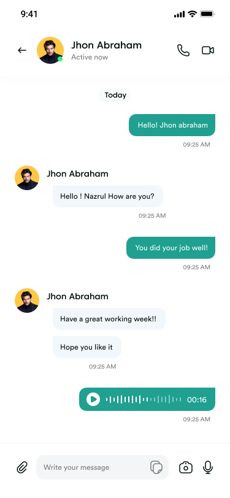

# ChatBox App 📱💬

[](https://flutter.dev/)
[](https://dart.dev/)
[](LICENSE)
[]()

A modern, feature-rich chat platform built with Flutter that turns conversations into celebrations. Chat without the hassle, with real-time messaging, offline capabilities, and delightful animations that make every interaction feel special.

## ✨ Features

| Feature | Description |
|---------|-------------|
| 💬 **Real-time Messaging** | Instant messaging with channels, unread counts, and message reactions |
| 🔄 **Offline Storage** | Chunked caching system for large data, ensuring messages persist offline |
| 🎤 **Speech-to-Text** | Voice message integration with advanced speech recognition |
| 🎉 **Animations & Confetti** | Smooth animations and celebration effects for interactive elements |
| 🛡️ **Type Safety** | Strongly typed models (e.g., AppMessage) with JSON serialization |
| 🌐 **Connection Handling** | Smart offline detection with graceful degradation (WhatsApp-style) |
| 🔐 **Authentication** | Firebase-based user authentication and Stream Chat integration |
| 📊 **Performance Monitoring** | Built-in logging and performance tracking for operations |

### Recent Improvements
- ✅ Fixed deprecated `reactionCounts`/`reactionScores` usage
- ✅ Resolved unread count calculation bug
- ✅ Enhanced type safety with proper model classes
- ✅ Implemented chunked storage for SharedPreferences limitations
- ✅ Added JSON serialization with `json_serializable`
- ✅ Improved error handling across services

## 📸 Screenshots & Demos

### Chat Interface

*Real-time messaging with smooth animations*

### Speech-to-Text in Action

*Voice messages with speech recognition*

### Connection States

*Graceful offline handling with network status indicator*

### Celebration Effects
*Confetti animations for special interactions*

## 🚀 Installation & Setup

### Prerequisites
- Flutter SDK (3.0 or higher)
- Dart SDK (3.0 or higher)
- Android Studio / Xcode for mobile development
- Firebase project with authentication enabled
- Stream Chat account

### Quick Start

1. **Clone the repository**
   ```bash
   git clone https://github.com/yourusername/chatbox-app.git
   cd chatbox-app
   ```

2. **Install Flutter dependencies**
   ```bash
   flutter pub get
   ```

3. **Configure Firebase**
   - Add your `google-services.json` to `android/app/`
   - Update `lib/firebase_options.dart` with your Firebase config

4. **Configure Stream Chat**
   - Update Stream Chat credentials in `lib/services/stream_chat_service.dart`
   - Set up your Stream Chat dashboard

5. **Run the app**
   ```bash
   flutter run
   ```

### Key Dependencies
```yaml
dependencies:
  flutter:
    sdk: flutter
  stream_chat_flutter: ^latest
  firebase_core: ^latest
  speech_to_text: ^7.3.0
  flutter_animate: ^4.5.2
  confetti: ^0.8.0
  shared_preferences: ^latest
  connectivity_plus: ^latest
```

## 📖 Usage

### For Users
1. **Sign Up/Login** with Firebase authentication
2. **Join Channels** or create new ones
3. **Send Messages** with text, voice, or attachments
4. **Enjoy Offline Mode** - messages sync when back online
5. **Use Speech-to-Text** for hands-free messaging

### For Developers
- **Custom Animations**: Use `flutter_animate` for UI enhancements
- **Offline Storage**: Extend `OfflineStorageService` for additional data types
- **Real-time Updates**: Leverage Stream Chat for instant messaging
- **Performance**: Monitor with built-in logging in services

## 🤝 Contributing

We welcome contributions! Here's how you can help:

1. Fork the repository
2. Create a feature branch (`git checkout -b feature/amazing-feature`)
3. Commit your changes (`git commit -m 'Add amazing feature'`)
4. Push to the branch (`git push origin feature/amazing-feature`)
5. Open a Pull Request

### Development Setup
```bash
# Run tests
flutter test

# Generate JSON serialization
flutter pub run build_runner build

# Analyze code
flutter analyze

# Format code
flutter format .
```

## 📝 Changelog

### v1.0.0 (Latest)
- ✨ Added flutter_animate and confetti for enhanced UX
- 🔧 Fixed deprecated Stream Chat API usage
- 🐛 Resolved unread message count bug
- 🛡️ Improved type safety with AppMessage models
- 💾 Implemented chunked storage for large data
- 🌐 Enhanced connection handling (WhatsApp-style offline mode)
- 📊 Added performance monitoring and logging

## 🙏 Acknowledgments

- [Stream Chat](https://getstream.io/chat/) for real-time messaging infrastructure
- [Firebase](https://firebase.google.com/) for authentication and backend services
- Flutter community for amazing packages and support

## 📄 License

This project is licensed under the MIT License - see the [LICENSE](LICENSE) file for details.

## 📧 Contact

- **Author**: Your Name
- **Email**: your.email@example.com
- **GitHub**: [@yourusername](https://github.com/yourusername)
- **Issues**: [GitHub Issues](https://github.com/yourusername/chatbox-app/issues)

---

*Made with ❤️ and lots of ☕ by the ChatBox team*

#Flutter #ChatApp #RealTimeMessaging #SpeechToText #OfflineStorage #Firebase #StreamChat
